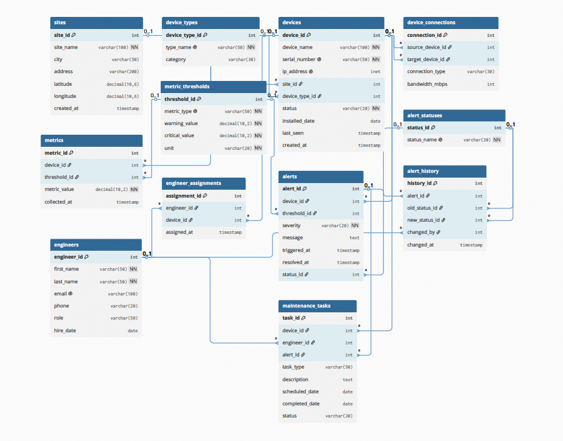

# РГР: Система мониторинга сети оператора (NOC)

## 1. Описание предметной области

Проект представляет собой базу данных для мониторинга сети оператора связи (Network Operations Center). Система предназначена для учёта оборудования, сбора метрик, генерации аварий при превышении пороговых значений, назначения инженеров на оборудование и планирования ремонтных задач.

**Ключевые сущности:**
- Площадки (базовые станции, дата-центры)
- Типы оборудования (gNB, eNB, Core Router, BBU, Transport Switch, Firewall, DHCP Server)
- Устройства (с серийными номерами и IP-адресами)
- Связи между устройствами (топология сети)
- Пороговые значения метрик (CPU, память, температура, трафик, диск, потеря пакетов, задержка)
- Собранные метрики устройств
- Аварии (с критичностью INFO, WARNING, CRITICAL)
- Статусы аварий (NEW, IN_PROGRESS, RESOLVED, CLOSED)
- Инженеры техподдержки (с ролями: NETWORK_ENGINEER, NOC_OPERATOR, SUPPORT)
- Закрепление инженеров за устройствами
- Задачи обслуживания (плановые и аварийные)
- История изменений статусов аварий

**Автоматизируемые бизнес-процессы:**
- Мониторинг состояния оборудования
- Автоматическое создание аварий при превышении порогов
- Назначение и контроль выполнения ремонтных задач
- Ведение истории изменений аварий
- Расчёт доступности устройств

## 2. Технологии

- **СУБД:** PostgreSQL
- **Процедурный язык:** PL/pgSQL
- **Инструменты:** Visual Studio Code, SQLTools

## 3. Структура базы данных (12 таблиц)

| Таблица | Назначение |
|---------|------------|
| sites | Площадки / базовые станции |
| device_types | Типы оборудования |
| devices | Устройства |
| device_connections | Связи между устройствами |
| metric_thresholds | Пороговые значения метрик |
| metrics | Собранные метрики |
| alert_statuses | Справочник статусов аварий |
| alerts | Аварии |
| engineers | Инженеры |
| engineer_assignments | Закрепление инженеров за устройствами |
| maintenance_tasks | Задачи обслуживания |
| alert_history | История изменений аварий |

## 4. ER-диаграмма



## 5. Тестовые данные

Общее количество записей: **более 100**

| Таблица | Количество записей |
|---------|-------------------|
| sites | 6 |
| device_types | 7 |
| devices | 12 |
| device_connections | 10 |
| metric_thresholds | 7 |
| metrics | 20 |
| alert_statuses | 4 |
| alerts | 10 |
| engineers | 8 |
| engineer_assignments | 13 |
| maintenance_tasks | 10 |
| alert_history | 12 |

## 6. Обоснование выбора ограничений (CHECK/UNIQUE) и стратегии индексации

### CHECK-ограничения

CHECK-ограничения добавлены для обеспечения бизнес-логики и защиты от невалидных данных:

- `chk_devices_status` — статус устройства может быть только active, maintenance или decommissioned, что отражает реальные состояния оборудования в сети.
- `chk_connection_type` — тип связи между устройствами ограничен тремя вариантами (ETHERNET, FIBER, WIRELESS), так как в телеком-сетях используются именно эти физические интерфейсы.
- `chk_bandwidth` — пропускная способность должна быть положительным числом, так как нулевая или отрицательная полоса не имеет физического смысла.
- `chk_threshold_values` — критический порог должен быть строго больше порога предупреждения, иначе логика классификации аварий нарушается.
- `chk_metric_value` — значение метрики не может быть отрицательным, так как это противоречит физическому смыслу измеряемых параметров.
- `chk_severity` — критичность аварии ограничена тремя уровнями (INFO, WARNING, CRITICAL) для унификации обработки.
- `chk_engineer_role` — роли инженеров стандартизированы для удобства управления доступом и распределения обязанностей.
- `chk_maintenance_type` и `chk_maintenance_status` — типы и статусы задач обслуживания ограничены для единообразия отчётности.

### UNIQUE-ограничения

UNIQUE-ограничения добавлены для предотвращения дублирования ключевых идентификаторов:

- `type_name` — названия типов устройств уникальны, чтобы избежать путаницы.
- `serial_number` — серийный номер устройства уникален, так как это физически уникальная характеристика оборудования.
- `ip_address` — IP-адрес уникален, так как в сети не может быть двух устройств с одинаковым IP.
- `email` — email инженера уникален для авторизации и исключения дублирования учётных записей.
- `status_name` — названия статусов аварий уникальны для однозначной идентификации.
- `metric_type` — типы метрик уникальны, чтобы каждому типу соответствовала одна запись с порогами.

### Стратегия индексации

Индексы созданы для ускорения наиболее частых операций в запросах:

- **`idx_devices_site_id` и `idx_devices_device_type_id`** — ускоряют JOIN и фильтрацию устройств по площадкам и типам оборудования.
- **`idx_metrics_device_id`** — критичен для запросов, собирающих метрики конкретного устройства (например, графики мониторинга).
- **`idx_metrics_collected_at`** — ускоряет сортировку и фильтрацию по времени (например, выборка метрик за последние 24 часа).
- **`idx_alerts_device_id` и `idx_alerts_status_id`** — ускоряют поиск аварий по устройству и фильтрацию по статусу.
- **`idx_alerts_triggered_at`** — ускоряет временные отчёты по авариям.
- **`idx_maintenance_tasks_device_id` и `idx_maintenance_tasks_engineer_id`** — ускоряют поиск задач по устройству и по инженеру.

## 7. Пояснение к функциям PL/pgSQL и триггерам

### Функция `get_device_availability(p_device_id INT)`

Функция вычисляет доступность устройства за последние 30 дней в процентах. Для этого она:
1. Определяет общее количество минут в 30 днях (43200 минут).
2. Суммирует длительность всех аварий (WARNING и CRITICAL) за последние 30 дней для указанного устройства. Если авария ещё не закрыта, длительность считается от момента создания до текущего момента.
3. Вычитает время аварий из общего времени и вычисляет процент доступности.

Функция возвращает округлённое до двух знаков число. Это полезно для формирования отчётов об уровне надёности оборудования (SLA).

### Функция `classify_alert_severity(p_metric_value NUMERIC, p_metric_type VARCHAR)`

Функция определяет уровень критичности аварии на основе порогов, заданных в таблице `metric_thresholds`. Логика работы:
1. По типу метрики находит соответствующие пороги предупреждения и критический.
2. Если значение метрики больше или равно критическому порогу → возвращает 'CRITICAL'.
3. Если значение метрики больше или равно порогу предупреждения → возвращает 'WARNING'.
4. Иначе возвращает 'INFO'.
5. Если тип метрики не найден в таблице порогов → возвращает 'UNKNOWN'.

Эта функция используется триггером для автоматической классификации аварий и может вызываться вручную для тестирования.

### Триггер `trg_metric_threshold_alert`

Триггер срабатывает **после** вставки новой записи в таблицу `metrics` и автоматически создаёт аварию, если значение метрики превышает пороговые значения.

**Почему выбран тип `AFTER INSERT`, а не `BEFORE INSERT`:**

Триггер создаёт новую запись в таблице `alerts`, что является изменением другой таблицы. Если использовать `BEFORE INSERT`, то при ошибке создания аварии вставка метрики могла бы быть отменена, что некорректно с бизнес-логики — метрика должна сохраняться в любом случае. `AFTER INSERT` гарантирует, что метрика уже сохранена, а авария создаётся как дополнительное действие.

**Почему выбран уровень `FOR EACH ROW`:**

Каждое измерение метрики — это отдельная строка. Нужно проверять каждую вставку на превышение порогов, поэтому триггер должен срабатывать для каждой строки, а не один раз на операцию.

**Логика работы:**
1. Получает тип метрики по `threshold_id` из таблицы `metric_thresholds`.
2. Вызывает функцию `classify_alert_severity()` для определения критичности.
3. Если критичность `WARNING` или `CRITICAL` — создаёт запись в `alerts` со статусом 'NEW'.
4. Иначе ничего не делает.

**Демонстрация работы триггера:**
```sql
-- Вставка метрики с превышением (threshold_id=1 → cpu_usage, значение 92 > critical=90)
INSERT INTO metrics (device_id, threshold_id, metric_value) VALUES (3, 1, 92);
-- Триггер автоматически создаст аварию CRITICAL
```

`Триггер автоматизирует процесс мониторинга и избавляет приложение от необходимости вручную проверять пороги и создавать аварии.`

### Триггер `trg_alerts_update_timestamp`

**Тип:** `BEFORE UPDATE ON alerts`

**Назначение:** автоматическое обновление поля `resolved_at` при изменении статуса аварии.

**Почему выбран тип `BEFORE UPDATE`, а не `AFTER UPDATE`:**

Триггер изменяет поле `resolved_at` в той же строке, которая обновляется. Это нужно сделать **до** сохранения строки, поэтому используется `BEFORE UPDATE`. `AFTER UPDATE` не позволил бы изменить значения обновляемой строки.

**Почему выбран уровень `FOR EACH ROW`:**

Нужно обрабатывать каждую обновляемую аварию индивидуально, так как у каждой свой статус и своя дата закрытия.

**Логика работы:**

1. Проверяет, изменился ли статус аварии (сравнивает `OLD.status_id` и `NEW.status_id`).
2. Если новый статус — закрывающий ('RESOLVED' или 'CLOSED'), устанавливает `NEW.resolved_at = NOW()`.
3. Если новый статус — открывающий ('NEW' или 'IN_PROGRESS'), сбрасывает `NEW.resolved_at = NULL`.

**Демонстрация работы триггера:**

```sql
-- Закрываем аварию (меняем статус на RESOLVED)
UPDATE alerts SET status_id = (SELECT status_id FROM alert_statuses WHERE status_name = 'RESOLVED')
WHERE alert_id = 1;
-- Триггер автоматически установит resolved_at = NOW()

-- Возвращаем аварию в работу (меняем статус на IN_PROGRESS)
UPDATE alerts SET status_id = (SELECT status_id FROM alert_statuses WHERE status_name = 'IN_PROGRESS')
WHERE alert_id = 1;
-- Триггер автоматически сбросит resolved_at в NULL
```

`Триггер гарантирует, что время закрытия аварии всегда соответствует моменту изменения статуса на закрывающий, и сбрасывается при повторном открытии аварии.`